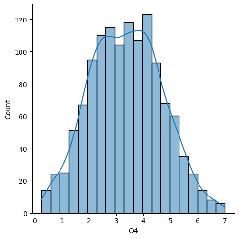
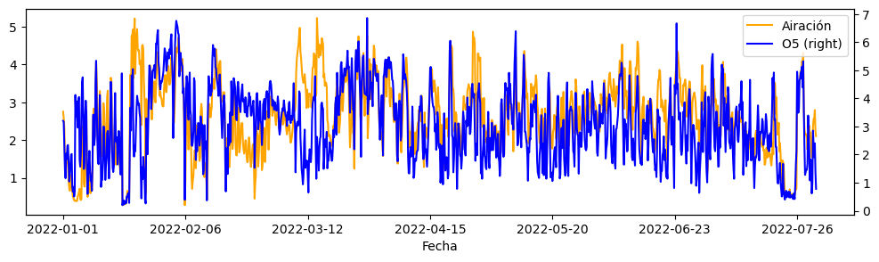
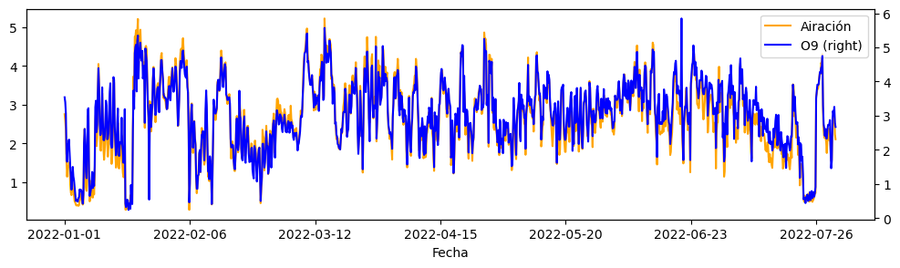
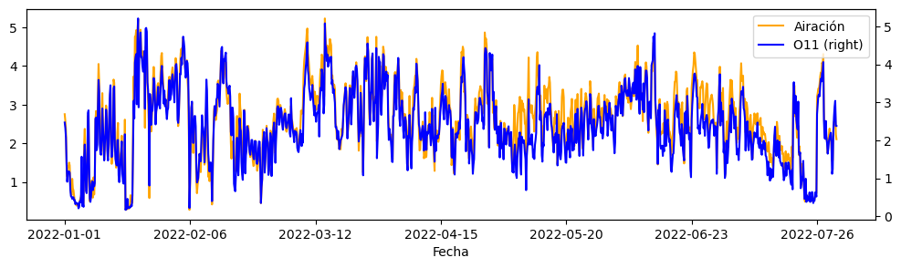

# Machine learning project 

## Client: AIWater
## Jan 2023

### Data Scientis: Sebastián Huneeus

# 1 Exploratory data analysis


```python
import pandas as pd
import numpy as np
import matplotlib.pyplot as plt
import seaborn as sns
```


```python
df = pd.read_csv('datos/datos_enero_julio.csv')
```


```python
df
```


<div>
<style scoped>
    .dataframe tbody tr th:only-of-type {
        vertical-align: middle;
    }

    .dataframe tbody tr th {
        vertical-align: top;
    }

    .dataframe thead th {
        text-align: right;
    }
</style>
<table border="1" class="dataframe">
  <thead>
    <tr style="text-align: right;">
      <th></th>
      <th>Unnamed: 0</th>
      <th>Fecha</th>
      <th>Hora</th>
      <th>O1</th>
      <th>O2</th>
      <th>O3</th>
      <th>O4</th>
      <th>O5</th>
      <th>O6</th>
      <th>O7</th>
      <th>O8</th>
      <th>O9</th>
      <th>O10</th>
      <th>O11</th>
      <th>O12</th>
      <th>Selector</th>
      <th>Airación</th>
    </tr>
  </thead>
  <tbody>
    <tr>
      <th>0</th>
      <td>1</td>
      <td>2022-01-01</td>
      <td>1899-12-31 01:00:00</td>
      <td>0.51</td>
      <td>3.21</td>
      <td>2.48</td>
      <td>2.71</td>
      <td>3.20</td>
      <td>1.95</td>
      <td>3.22</td>
      <td>3.10</td>
      <td>3.54</td>
      <td>2.61</td>
      <td>2.47</td>
      <td>2.38</td>
      <td>2.422</td>
      <td>2.752857</td>
    </tr>
    <tr>
      <th>1</th>
      <td>2</td>
      <td>2022-01-01</td>
      <td>1899-12-31 05:00:00</td>
      <td>0.69</td>
      <td>3.53</td>
      <td>2.25</td>
      <td>2.83</td>
      <td>3.17</td>
      <td>1.58</td>
      <td>2.45</td>
      <td>2.94</td>
      <td>3.40</td>
      <td>2.85</td>
      <td>2.33</td>
      <td>2.56</td>
      <td>2.494</td>
      <td>2.587143</td>
    </tr>
    <tr>
      <th>2</th>
      <td>3</td>
      <td>2022-01-01</td>
      <td>1899-12-31 09:00:00</td>
      <td>0.78</td>
      <td>3.62</td>
      <td>2.03</td>
      <td>2.41</td>
      <td>2.35</td>
      <td>1.53</td>
      <td>2.39</td>
      <td>2.63</td>
      <td>3.07</td>
      <td>2.33</td>
      <td>2.08</td>
      <td>2.37</td>
      <td>2.238</td>
      <td>2.342857</td>
    </tr>
    <tr>
      <th>3</th>
      <td>4</td>
      <td>2022-01-01</td>
      <td>1899-12-31 13:00:00</td>
      <td>0.71</td>
      <td>2.54</td>
      <td>1.63</td>
      <td>1.89</td>
      <td>1.47</td>
      <td>0.87</td>
      <td>1.71</td>
      <td>1.96</td>
      <td>1.88</td>
      <td>1.49</td>
      <td>1.36</td>
      <td>1.17</td>
      <td>1.648</td>
      <td>1.491429</td>
    </tr>
    <tr>
      <th>4</th>
      <td>5</td>
      <td>2022-01-01</td>
      <td>1899-12-31 17:00:00</td>
      <td>0.73</td>
      <td>2.14</td>
      <td>1.14</td>
      <td>1.37</td>
      <td>1.16</td>
      <td>0.58</td>
      <td>1.17</td>
      <td>1.86</td>
      <td>1.65</td>
      <td>0.95</td>
      <td>0.91</td>
      <td>0.84</td>
      <td>1.308</td>
      <td>1.137143</td>
    </tr>
    <tr>
      <th>...</th>
      <td>...</td>
      <td>...</td>
      <td>...</td>
      <td>...</td>
      <td>...</td>
      <td>...</td>
      <td>...</td>
      <td>...</td>
      <td>...</td>
      <td>...</td>
      <td>...</td>
      <td>...</td>
      <td>...</td>
      <td>...</td>
      <td>...</td>
      <td>...</td>
      <td>...</td>
    </tr>
    <tr>
      <th>1256</th>
      <td>1257</td>
      <td>2022-07-31</td>
      <td>1899-12-31 01:00:00</td>
      <td>2.40</td>
      <td>4.47</td>
      <td>2.43</td>
      <td>2.63</td>
      <td>2.29</td>
      <td>1.44</td>
      <td>2.35</td>
      <td>2.81</td>
      <td>3.14</td>
      <td>2.59</td>
      <td>2.62</td>
      <td>2.96</td>
      <td>2.844</td>
      <td>2.558571</td>
    </tr>
    <tr>
      <th>1257</th>
      <td>1258</td>
      <td>2022-07-31</td>
      <td>1899-12-31 05:00:00</td>
      <td>2.34</td>
      <td>4.69</td>
      <td>2.60</td>
      <td>2.43</td>
      <td>1.90</td>
      <td>1.22</td>
      <td>1.95</td>
      <td>2.93</td>
      <td>3.01</td>
      <td>2.72</td>
      <td>2.89</td>
      <td>3.13</td>
      <td>2.792</td>
      <td>2.550000</td>
    </tr>
    <tr>
      <th>1258</th>
      <td>1259</td>
      <td>2022-07-31</td>
      <td>1899-12-31 09:00:00</td>
      <td>2.53</td>
      <td>4.89</td>
      <td>2.75</td>
      <td>2.50</td>
      <td>2.40</td>
      <td>1.33</td>
      <td>2.51</td>
      <td>3.01</td>
      <td>3.26</td>
      <td>3.21</td>
      <td>3.04</td>
      <td>3.21</td>
      <td>3.014</td>
      <td>2.795714</td>
    </tr>
    <tr>
      <th>1259</th>
      <td>1260</td>
      <td>2022-07-31</td>
      <td>1899-12-31 15:00:00</td>
      <td>3.05</td>
      <td>4.32</td>
      <td>1.74</td>
      <td>1.56</td>
      <td>1.37</td>
      <td>0.89</td>
      <td>1.89</td>
      <td>2.51</td>
      <td>2.79</td>
      <td>2.35</td>
      <td>2.38</td>
      <td>2.80</td>
      <td>2.408</td>
      <td>2.230000</td>
    </tr>
    <tr>
      <th>1260</th>
      <td>1261</td>
      <td>2022-07-31</td>
      <td>1899-12-31 17:00:00</td>
      <td>2.32</td>
      <td>0.31</td>
      <td>1.42</td>
      <td>1.11</td>
      <td>0.78</td>
      <td>0.68</td>
      <td>1.59</td>
      <td>2.46</td>
      <td>2.67</td>
      <td>2.33</td>
      <td>2.38</td>
      <td>2.63</td>
      <td>1.188</td>
      <td>2.105714</td>
    </tr>
  </tbody>
</table>
<p>1261 rows × 17 columns</p>
</div>


```python
df.describe().T
```


<div>
<style scoped>
    .dataframe tbody tr th:only-of-type {
        vertical-align: middle;
    }

    .dataframe tbody tr th {
        vertical-align: top;
    }

    .dataframe thead th {
        text-align: right;
    }
</style>
<table border="1" class="dataframe">
  <thead>
    <tr style="text-align: right;">
      <th></th>
      <th>count</th>
      <th>mean</th>
      <th>std</th>
      <th>min</th>
      <th>25%</th>
      <th>50%</th>
      <th>75%</th>
      <th>max</th>
    </tr>
  </thead>
  <tbody>
    <tr>
      <th>Unnamed: 0</th>
      <td>1261.0</td>
      <td>631.000000</td>
      <td>364.163654</td>
      <td>1.000</td>
      <td>316.000000</td>
      <td>631.000000</td>
      <td>946.000000</td>
      <td>1261.000000</td>
    </tr>
    <tr>
      <th>O1</th>
      <td>1261.0</td>
      <td>2.153053</td>
      <td>1.226441</td>
      <td>0.250</td>
      <td>1.170000</td>
      <td>1.960000</td>
      <td>2.860000</td>
      <td>8.490000</td>
    </tr>
    <tr>
      <th>O2</th>
      <td>1261.0</td>
      <td>3.574853</td>
      <td>1.181473</td>
      <td>0.310</td>
      <td>2.770000</td>
      <td>3.410000</td>
      <td>4.350000</td>
      <td>8.070000</td>
    </tr>
    <tr>
      <th>O3</th>
      <td>1261.0</td>
      <td>3.208509</td>
      <td>5.046665</td>
      <td>0.230</td>
      <td>2.200000</td>
      <td>3.040000</td>
      <td>3.920000</td>
      <td>177.000000</td>
    </tr>
    <tr>
      <th>O4</th>
      <td>1261.0</td>
      <td>3.363688</td>
      <td>1.309204</td>
      <td>0.250</td>
      <td>2.380000</td>
      <td>3.360000</td>
      <td>4.280000</td>
      <td>7.000000</td>
    </tr>
    <tr>
      <th>O5</th>
      <td>1261.0</td>
      <td>3.089865</td>
      <td>1.343925</td>
      <td>0.200</td>
      <td>2.090000</td>
      <td>3.060000</td>
      <td>4.030000</td>
      <td>6.860000</td>
    </tr>
    <tr>
      <th>O6</th>
      <td>1261.0</td>
      <td>2.261285</td>
      <td>1.141012</td>
      <td>0.090</td>
      <td>1.430000</td>
      <td>2.160000</td>
      <td>3.040000</td>
      <td>7.220000</td>
    </tr>
    <tr>
      <th>O7</th>
      <td>1261.0</td>
      <td>2.940476</td>
      <td>2.057982</td>
      <td>0.250</td>
      <td>2.150000</td>
      <td>2.900000</td>
      <td>3.680000</td>
      <td>63.280000</td>
    </tr>
    <tr>
      <th>O8</th>
      <td>1261.0</td>
      <td>3.121427</td>
      <td>1.127693</td>
      <td>0.260</td>
      <td>2.450000</td>
      <td>3.170000</td>
      <td>3.870000</td>
      <td>7.680000</td>
    </tr>
    <tr>
      <th>O9</th>
      <td>1261.0</td>
      <td>3.065250</td>
      <td>1.077779</td>
      <td>0.240</td>
      <td>2.400000</td>
      <td>3.110000</td>
      <td>3.750000</td>
      <td>7.620000</td>
    </tr>
    <tr>
      <th>O10</th>
      <td>1261.0</td>
      <td>2.633545</td>
      <td>1.067298</td>
      <td>0.140</td>
      <td>1.970000</td>
      <td>2.590000</td>
      <td>3.270000</td>
      <td>7.520000</td>
    </tr>
    <tr>
      <th>O11</th>
      <td>1261.0</td>
      <td>2.452109</td>
      <td>1.105146</td>
      <td>0.170</td>
      <td>1.820000</td>
      <td>2.380000</td>
      <td>3.040000</td>
      <td>16.000000</td>
    </tr>
    <tr>
      <th>O12</th>
      <td>1261.0</td>
      <td>2.495908</td>
      <td>1.022001</td>
      <td>0.170</td>
      <td>1.870000</td>
      <td>2.430000</td>
      <td>3.080000</td>
      <td>7.320000</td>
    </tr>
    <tr>
      <th>Selector</th>
      <td>1261.0</td>
      <td>3.076343</td>
      <td>1.415870</td>
      <td>0.424</td>
      <td>2.322000</td>
      <td>3.020000</td>
      <td>3.700000</td>
      <td>37.250000</td>
    </tr>
    <tr>
      <th>Airación</th>
      <td>1261.0</td>
      <td>2.709916</td>
      <td>1.062122</td>
      <td>0.280</td>
      <td>2.085714</td>
      <td>2.702857</td>
      <td>3.334286</td>
      <td>11.088571</td>
    </tr>
  </tbody>
</table>
</div>


# Distribution plots


```python
for colname in ['O1', 'O2', 'O3', 'O4', 'O5', 'O6', 'O7','O8','O9','O10','O11', 'O12', 'Selector', 'Airación']:
    
    sns.displot(df, x=colname, kde=True)
```


    

    


    

    


    

    


    

    


    

    


    

    


    

    


    

    


    

    


    

    


    

    


    

    


    

    


    

    


Distribution plots help outlier detection.  A sensitive way to del with outliers is to trim down the data, discarding observations located in the lowest/highets percentiles. I'll keep observations smaller than a Z value of 3  - or less distant to three standard deviations from the variable mean.    


```python
df['ID']=np.arange(1,len(df)+1)
```


```python
from scipy import stats

df_trim=df.iloc[:,3:][(np.abs(stats.zscore(df.iloc[:,3:])) < 3).all(axis=1)]
```


```python
df_trim.describe().T
```


<div>
<style scoped>
    .dataframe tbody tr th:only-of-type {
        vertical-align: middle;
    }

    .dataframe tbody tr th {
        vertical-align: top;
    }

    .dataframe thead th {
        text-align: right;
    }
</style>
<table border="1" class="dataframe">
  <thead>
    <tr style="text-align: right;">
      <th></th>
      <th>count</th>
      <th>mean</th>
      <th>std</th>
      <th>min</th>
      <th>25%</th>
      <th>50%</th>
      <th>75%</th>
      <th>max</th>
    </tr>
  </thead>
  <tbody>
    <tr>
      <th>O1</th>
      <td>1232.0</td>
      <td>2.096445</td>
      <td>1.109235</td>
      <td>0.250</td>
      <td>1.160000</td>
      <td>1.945</td>
      <td>2.820000</td>
      <td>5.670000</td>
    </tr>
    <tr>
      <th>O2</th>
      <td>1232.0</td>
      <td>3.534334</td>
      <td>1.123165</td>
      <td>0.310</td>
      <td>2.750000</td>
      <td>3.395</td>
      <td>4.330000</td>
      <td>6.860000</td>
    </tr>
    <tr>
      <th>O3</th>
      <td>1232.0</td>
      <td>3.031088</td>
      <td>1.175490</td>
      <td>0.230</td>
      <td>2.162500</td>
      <td>3.015</td>
      <td>3.882500</td>
      <td>6.310000</td>
    </tr>
    <tr>
      <th>O4</th>
      <td>1232.0</td>
      <td>3.334131</td>
      <td>1.286144</td>
      <td>0.250</td>
      <td>2.367500</td>
      <td>3.335</td>
      <td>4.252500</td>
      <td>6.920000</td>
    </tr>
    <tr>
      <th>O5</th>
      <td>1232.0</td>
      <td>3.062995</td>
      <td>1.323110</td>
      <td>0.200</td>
      <td>2.077500</td>
      <td>3.050</td>
      <td>4.010000</td>
      <td>6.860000</td>
    </tr>
    <tr>
      <th>O6</th>
      <td>1232.0</td>
      <td>2.204261</td>
      <td>1.067393</td>
      <td>0.090</td>
      <td>1.417500</td>
      <td>2.120</td>
      <td>2.992500</td>
      <td>5.470000</td>
    </tr>
    <tr>
      <th>O7</th>
      <td>1232.0</td>
      <td>2.841169</td>
      <td>1.097014</td>
      <td>0.250</td>
      <td>2.140000</td>
      <td>2.890</td>
      <td>3.630000</td>
      <td>5.570000</td>
    </tr>
    <tr>
      <th>O8</th>
      <td>1232.0</td>
      <td>3.072898</td>
      <td>1.069664</td>
      <td>0.260</td>
      <td>2.440000</td>
      <td>3.140</td>
      <td>3.830000</td>
      <td>5.680000</td>
    </tr>
    <tr>
      <th>O9</th>
      <td>1232.0</td>
      <td>3.017646</td>
      <td>1.014465</td>
      <td>0.240</td>
      <td>2.390000</td>
      <td>3.095</td>
      <td>3.722500</td>
      <td>5.850000</td>
    </tr>
    <tr>
      <th>O10</th>
      <td>1232.0</td>
      <td>2.582021</td>
      <td>0.986003</td>
      <td>0.140</td>
      <td>1.950000</td>
      <td>2.560</td>
      <td>3.240000</td>
      <td>5.320000</td>
    </tr>
    <tr>
      <th>O11</th>
      <td>1232.0</td>
      <td>2.391339</td>
      <td>0.953600</td>
      <td>0.170</td>
      <td>1.800000</td>
      <td>2.370</td>
      <td>3.000000</td>
      <td>5.210000</td>
    </tr>
    <tr>
      <th>O12</th>
      <td>1232.0</td>
      <td>2.445641</td>
      <td>0.932615</td>
      <td>0.170</td>
      <td>1.860000</td>
      <td>2.410</td>
      <td>3.040000</td>
      <td>5.280000</td>
    </tr>
    <tr>
      <th>Selector</th>
      <td>1232.0</td>
      <td>3.010109</td>
      <td>0.980161</td>
      <td>0.424</td>
      <td>2.308000</td>
      <td>3.010</td>
      <td>3.652000</td>
      <td>6.068000</td>
    </tr>
    <tr>
      <th>Airación</th>
      <td>1232.0</td>
      <td>2.650625</td>
      <td>0.962480</td>
      <td>0.280</td>
      <td>2.070357</td>
      <td>2.660</td>
      <td>3.288214</td>
      <td>5.228571</td>
    </tr>
    <tr>
      <th>ID</th>
      <td>1232.0</td>
      <td>637.392857</td>
      <td>363.442997</td>
      <td>1.000</td>
      <td>324.750000</td>
      <td>635.500</td>
      <td>953.250000</td>
      <td>1261.000000</td>
    </tr>
  </tbody>
</table>
</div>


```python
for colname in ['O1', 'O2', 'O3', 'O4', 'O5', 'O6', 'O7','O8','O9','O10','O11', 'O12', 'Selector', 'Airación' ]:
    
    sns.displot(df_trim, x=colname, kde=True)
```


    

    


    

    


    

    


    

    


    

    


    

    


    

    


    

    


    

    


    

    


    

    


    

    


    

    


    

    


```python
cols_to_use = df_trim.columns.difference(df.columns)

df_trimmed = pd.merge(df_trim[cols_to_use], df, left_index=True, right_index=True, how='left')
```

# Correlation plots

Having trimmed outliers, correlation plots show strong synchronic and diachronic correlation between variables. This could affect the size and significance of OLS regression coefficients. 

The next plots show the temporal correlation between the dependant variable ("Airación") and a vector of independent variables. 


```python
for colname in ['O1', 'O2', 'O3', 'O4', 'O5', 'O6', 'O7','O8','O9','O10','O11', 'O12', 'Selector' ]:
    
    fig, ax = plt.subplots()# Plot the first x and y axes:

    df_trimmed.plot(
        use_index=True, 
        y='Airación', 
        ax=ax, 
        x = 'Fecha',
        color='orange',
        figsize=(12, 3))
    df_trimmed.plot(
        use_index=True, 
        y= colname, 
        ax=ax, 
        x = 'Fecha',
        secondary_y=True, 
        color='blue',
        figsize=(12, 3))
    
    plt.show()
```


    

    


    

    


    

    


    

    


    

    


    

    


    

    


    

    


    

    


    

    


    

    


    

    


    

    


### Is there correlation between the dependent variable Y and the other Xs? 

Yes, there is both temporal and cross-sectional correlation between the Xs and the Y. 


```python
sns.heatmap(df_trimmed.corr(), annot = True, cmap = 'vlag')


sns.set(rc={'figure.figsize':(20,20)})


```

    /var/folders/lc/lhrpm9yj66z82tp7q3nbgr440000gn/T/ipykernel_992/1548811932.py:1: FutureWarning: The default value of numeric_only in DataFrame.corr is deprecated. In a future version, it will default to False. Select only valid columns or specify the value of numeric_only to silence this warning.
      sns.heatmap(df_trimmed.corr(), annot = True, cmap = 'vlag')


    

    


```python
df_trimmed[['O1', 'O2', 'O3', 'O4', 'O5', 'O6', 'O7',
       'O8', 'O9', 'O10', 'O11', 'O12', 'Selector', 'Airación']]
```


<div>
<style scoped>
    .dataframe tbody tr th:only-of-type {
        vertical-align: middle;
    }

    .dataframe tbody tr th {
        vertical-align: top;
    }

    .dataframe thead th {
        text-align: right;
    }
</style>
<table border="1" class="dataframe">
  <thead>
    <tr style="text-align: right;">
      <th></th>
      <th>O1</th>
      <th>O2</th>
      <th>O3</th>
      <th>O4</th>
      <th>O5</th>
      <th>O6</th>
      <th>O7</th>
      <th>O8</th>
      <th>O9</th>
      <th>O10</th>
      <th>O11</th>
      <th>O12</th>
      <th>Selector</th>
      <th>Airación</th>
    </tr>
  </thead>
  <tbody>
    <tr>
      <th>0</th>
      <td>0.51</td>
      <td>3.21</td>
      <td>2.48</td>
      <td>2.71</td>
      <td>3.20</td>
      <td>1.95</td>
      <td>3.22</td>
      <td>3.10</td>
      <td>3.54</td>
      <td>2.61</td>
      <td>2.47</td>
      <td>2.38</td>
      <td>2.422</td>
      <td>2.752857</td>
    </tr>
    <tr>
      <th>1</th>
      <td>0.69</td>
      <td>3.53</td>
      <td>2.25</td>
      <td>2.83</td>
      <td>3.17</td>
      <td>1.58</td>
      <td>2.45</td>
      <td>2.94</td>
      <td>3.40</td>
      <td>2.85</td>
      <td>2.33</td>
      <td>2.56</td>
      <td>2.494</td>
      <td>2.587143</td>
    </tr>
    <tr>
      <th>2</th>
      <td>0.78</td>
      <td>3.62</td>
      <td>2.03</td>
      <td>2.41</td>
      <td>2.35</td>
      <td>1.53</td>
      <td>2.39</td>
      <td>2.63</td>
      <td>3.07</td>
      <td>2.33</td>
      <td>2.08</td>
      <td>2.37</td>
      <td>2.238</td>
      <td>2.342857</td>
    </tr>
    <tr>
      <th>3</th>
      <td>0.71</td>
      <td>2.54</td>
      <td>1.63</td>
      <td>1.89</td>
      <td>1.47</td>
      <td>0.87</td>
      <td>1.71</td>
      <td>1.96</td>
      <td>1.88</td>
      <td>1.49</td>
      <td>1.36</td>
      <td>1.17</td>
      <td>1.648</td>
      <td>1.491429</td>
    </tr>
    <tr>
      <th>4</th>
      <td>0.73</td>
      <td>2.14</td>
      <td>1.14</td>
      <td>1.37</td>
      <td>1.16</td>
      <td>0.58</td>
      <td>1.17</td>
      <td>1.86</td>
      <td>1.65</td>
      <td>0.95</td>
      <td>0.91</td>
      <td>0.84</td>
      <td>1.308</td>
      <td>1.137143</td>
    </tr>
    <tr>
      <th>...</th>
      <td>...</td>
      <td>...</td>
      <td>...</td>
      <td>...</td>
      <td>...</td>
      <td>...</td>
      <td>...</td>
      <td>...</td>
      <td>...</td>
      <td>...</td>
      <td>...</td>
      <td>...</td>
      <td>...</td>
      <td>...</td>
    </tr>
    <tr>
      <th>1256</th>
      <td>2.40</td>
      <td>4.47</td>
      <td>2.43</td>
      <td>2.63</td>
      <td>2.29</td>
      <td>1.44</td>
      <td>2.35</td>
      <td>2.81</td>
      <td>3.14</td>
      <td>2.59</td>
      <td>2.62</td>
      <td>2.96</td>
      <td>2.844</td>
      <td>2.558571</td>
    </tr>
    <tr>
      <th>1257</th>
      <td>2.34</td>
      <td>4.69</td>
      <td>2.60</td>
      <td>2.43</td>
      <td>1.90</td>
      <td>1.22</td>
      <td>1.95</td>
      <td>2.93</td>
      <td>3.01</td>
      <td>2.72</td>
      <td>2.89</td>
      <td>3.13</td>
      <td>2.792</td>
      <td>2.550000</td>
    </tr>
    <tr>
      <th>1258</th>
      <td>2.53</td>
      <td>4.89</td>
      <td>2.75</td>
      <td>2.50</td>
      <td>2.40</td>
      <td>1.33</td>
      <td>2.51</td>
      <td>3.01</td>
      <td>3.26</td>
      <td>3.21</td>
      <td>3.04</td>
      <td>3.21</td>
      <td>3.014</td>
      <td>2.795714</td>
    </tr>
    <tr>
      <th>1259</th>
      <td>3.05</td>
      <td>4.32</td>
      <td>1.74</td>
      <td>1.56</td>
      <td>1.37</td>
      <td>0.89</td>
      <td>1.89</td>
      <td>2.51</td>
      <td>2.79</td>
      <td>2.35</td>
      <td>2.38</td>
      <td>2.80</td>
      <td>2.408</td>
      <td>2.230000</td>
    </tr>
    <tr>
      <th>1260</th>
      <td>2.32</td>
      <td>0.31</td>
      <td>1.42</td>
      <td>1.11</td>
      <td>0.78</td>
      <td>0.68</td>
      <td>1.59</td>
      <td>2.46</td>
      <td>2.67</td>
      <td>2.33</td>
      <td>2.38</td>
      <td>2.63</td>
      <td>1.188</td>
      <td>2.105714</td>
    </tr>
  </tbody>
</table>
<p>1232 rows × 14 columns</p>
</div>


```python
cols_to_use=df_trimmed[['O1', 'O2', 'O3', 'O4', 'O5', 'O6', 'O7',
       'O8', 'O9', 'O10', 'O11', 'O12', 'Selector', 'Airación']]


sns.pairplot(cols_to_use, hue = 'Airación', palette= 'viridis_r')
```


    <seaborn.axisgrid.PairGrid at 0x2a9661250>


    

    


## OLS model

However, the high correlation doesn't affect our metric of interest: R2. Hnceforth, we sholdn't exclude variables from the models. 


```python
import statsmodels.formula.api as snf

X = ' + '.join(['O1', 'O2', 'O3', 'O4', 'O5', 'O6', 'O7',
       'O8', 'O9', 'O10', 'O11', 'O12', 'Selector'])

Y = ' Airación ~'

model_ols = snf.ols(Y + X, df_trimmed).fit()

model_ols.summary()
```


<table class="simpletable">
<caption>OLS Regression Results</caption>
<tr>
  <th>Dep. Variable:</th>        <td>Airación</td>     <th>  R-squared:         </th>  <td>   1.000</td> 
</tr>
<tr>
  <th>Model:</th>                   <td>OLS</td>       <th>  Adj. R-squared:    </th>  <td>   1.000</td> 
</tr>
<tr>
  <th>Method:</th>             <td>Least Squares</td>  <th>  F-statistic:       </th>  <td>9.625e+06</td>
</tr>
<tr>
  <th>Date:</th>             <td>Wed, 22 Feb 2023</td> <th>  Prob (F-statistic):</th>   <td>  0.00</td>  
</tr>
<tr>
  <th>Time:</th>                 <td>13:24:49</td>     <th>  Log-Likelihood:    </th>  <td>  5408.1</td> 
</tr>
<tr>
  <th>No. Observations:</th>      <td>  1232</td>      <th>  AIC:               </th> <td>-1.079e+04</td>
</tr>
<tr>
  <th>Df Residuals:</th>          <td>  1218</td>      <th>  BIC:               </th> <td>-1.072e+04</td>
</tr>
<tr>
  <th>Df Model:</th>              <td>    13</td>      <th>                     </th>      <td> </td>    
</tr>
<tr>
  <th>Covariance Type:</th>      <td>nonrobust</td>    <th>                     </th>      <td> </td>    
</tr>
</table>
<table class="simpletable">
<tr>
      <td></td>         <th>coef</th>     <th>std err</th>      <th>t</th>      <th>P>|t|</th>  <th>[0.025</th>    <th>0.975]</th>  
</tr>
<tr>
  <th>Intercept</th> <td>   -0.0002</td> <td>    0.000</td> <td>   -0.441</td> <td> 0.659</td> <td>   -0.001</td> <td>    0.001</td>
</tr>
<tr>
  <th>O1</th>        <td>-3.441e-05</td> <td>    0.001</td> <td>   -0.047</td> <td> 0.962</td> <td>   -0.001</td> <td>    0.001</td>
</tr>
<tr>
  <th>O2</th>        <td> 5.592e-05</td> <td>    0.001</td> <td>    0.077</td> <td> 0.939</td> <td>   -0.001</td> <td>    0.001</td>
</tr>
<tr>
  <th>O3</th>        <td> 6.503e-05</td> <td>    0.001</td> <td>    0.084</td> <td> 0.933</td> <td>   -0.001</td> <td>    0.002</td>
</tr>
<tr>
  <th>O4</th>        <td>    0.0002</td> <td>    0.001</td> <td>    0.248</td> <td> 0.804</td> <td>   -0.001</td> <td>    0.002</td>
</tr>
<tr>
  <th>O5</th>        <td> 8.039e-05</td> <td>    0.001</td> <td>    0.103</td> <td> 0.918</td> <td>   -0.001</td> <td>    0.002</td>
</tr>
<tr>
  <th>O6</th>        <td>    0.1429</td> <td>    0.000</td> <td>  610.826</td> <td> 0.000</td> <td>    0.142</td> <td>    0.143</td>
</tr>
<tr>
  <th>O7</th>        <td>    0.1424</td> <td>    0.000</td> <td>  379.064</td> <td> 0.000</td> <td>    0.142</td> <td>    0.143</td>
</tr>
<tr>
  <th>O8</th>        <td>    0.1434</td> <td>    0.000</td> <td>  323.306</td> <td> 0.000</td> <td>    0.142</td> <td>    0.144</td>
</tr>
<tr>
  <th>O9</th>        <td>    0.1427</td> <td>    0.000</td> <td>  343.382</td> <td> 0.000</td> <td>    0.142</td> <td>    0.143</td>
</tr>
<tr>
  <th>O10</th>       <td>    0.1435</td> <td>    0.000</td> <td>  341.533</td> <td> 0.000</td> <td>    0.143</td> <td>    0.144</td>
</tr>
<tr>
  <th>O11</th>       <td>    0.1423</td> <td>    0.000</td> <td>  296.033</td> <td> 0.000</td> <td>    0.141</td> <td>    0.143</td>
</tr>
<tr>
  <th>O12</th>       <td>    0.1429</td> <td>    0.000</td> <td>  428.343</td> <td> 0.000</td> <td>    0.142</td> <td>    0.144</td>
</tr>
<tr>
  <th>Selector</th>  <td>   -0.0004</td> <td>    0.004</td> <td>   -0.115</td> <td> 0.909</td> <td>   -0.007</td> <td>    0.007</td>
</tr>
</table>
<table class="simpletable">
<tr>
  <th>Omnibus:</th>       <td>3477.809</td> <th>  Durbin-Watson:     </th>   <td>   2.005</td>  
</tr>
<tr>
  <th>Prob(Omnibus):</th>  <td> 0.000</td>  <th>  Jarque-Bera (JB):  </th> <td>75707168.849</td>
</tr>
<tr>
  <th>Skew:</th>           <td>-34.745</td> <th>  Prob(JB):          </th>   <td>    0.00</td>  
</tr>
<tr>
  <th>Kurtosis:</th>      <td>1215.430</td> <th>  Cond. No.          </th>   <td>    491.</td>  
</tr>
</table><br/><br/>Notes:<br/>[1] Standard Errors assume that the covariance matrix of the errors is correctly specified.


# Machine learning models 

Four machine learning models will be compared based on their predictive performance using the R2 metric. The dependant variable is a continous integer that reflects the amount of oxigen coming out from a water treatment system. 


```python
from sklearn.model_selection import train_test_split
from sklearn.model_selection import GridSearchCV
from sklearn.ensemble import AdaBoostRegressor, RandomForestRegressor
from sklearn.tree import DecisionTreeRegressor
from sklearn.linear_model import LinearRegression
from xgboost import XGBRegressor
from sklearn import metrics
```


```python
X = df_trimmed.iloc[:,3:-2]  # X

Y= df_trimmed.iloc[:,-2]  #  y
```


```python
# Keep 25% of the data for testing

X_train, X_test, y_train, y_test = train_test_split(X, Y, test_size = 0.25, random_state = 4833)
```

## Linear regression


```python
search_space = {'fit_intercept': [True, False]}
```


```python
modelo_OLS_CV = GridSearchCV(estimator= LinearRegression(), 
                param_grid= search_space, 
                scoring = ["r2"],
                refit = "r2",
                cv = 3).fit(X_train, y_train)
```


```python
print(modelo_OLS_CV.best_estimator_)
```

    LinearRegression()


```python
regr = LinearRegression(fit_intercept = True)

regr_model = regr.fit(X_train, y_train)

y_pred_ols=regr_model.predict(X_test)

metrics.r2_score(y_pred_ols, y_test)
```


    0.9999519612549966


### Ensemble  methods
## AdaBoost


```python
search_space = {'loss': ['linear', 'square', 'exponential'],
                        'learning_rate': np.linspace(0.01, 1), 
                        'n_estimators':[10,50,250]}
```


```python
modelo_adaboost_CV = GridSearchCV(
    estimator =AdaBoostRegressor(), 
    param_grid= search_space, 
    scoring = ["r2"],
    refit = "r2",
    cv = 5).fit(X_train, y_train)
```


```python
modelo_adaboost_CV.best_estimator_
```


<style>#sk-container-id-1 {color: black;background-color: white;}#sk-container-id-1 pre{padding: 0;}#sk-container-id-1 div.sk-toggleable {background-color: white;}#sk-container-id-1 label.sk-toggleable__label {cursor: pointer;display: block;width: 100%;margin-bottom: 0;padding: 0.3em;box-sizing: border-box;text-align: center;}#sk-container-id-1 label.sk-toggleable__label-arrow:before {content: "▸";float: left;margin-right: 0.25em;color: #696969;}#sk-container-id-1 label.sk-toggleable__label-arrow:hover:before {color: black;}#sk-container-id-1 div.sk-estimator:hover label.sk-toggleable__label-arrow:before {color: black;}#sk-container-id-1 div.sk-toggleable__content {max-height: 0;max-width: 0;overflow: hidden;text-align: left;background-color: #f0f8ff;}#sk-container-id-1 div.sk-toggleable__content pre {margin: 0.2em;color: black;border-radius: 0.25em;background-color: #f0f8ff;}#sk-container-id-1 input.sk-toggleable__control:checked~div.sk-toggleable__content {max-height: 200px;max-width: 100%;overflow: auto;}#sk-container-id-1 input.sk-toggleable__control:checked~label.sk-toggleable__label-arrow:before {content: "▾";}#sk-container-id-1 div.sk-estimator input.sk-toggleable__control:checked~label.sk-toggleable__label {background-color: #d4ebff;}#sk-container-id-1 div.sk-label input.sk-toggleable__control:checked~label.sk-toggleable__label {background-color: #d4ebff;}#sk-container-id-1 input.sk-hidden--visually {border: 0;clip: rect(1px 1px 1px 1px);clip: rect(1px, 1px, 1px, 1px);height: 1px;margin: -1px;overflow: hidden;padding: 0;position: absolute;width: 1px;}#sk-container-id-1 div.sk-estimator {font-family: monospace;background-color: #f0f8ff;border: 1px dotted black;border-radius: 0.25em;box-sizing: border-box;margin-bottom: 0.5em;}#sk-container-id-1 div.sk-estimator:hover {background-color: #d4ebff;}#sk-container-id-1 div.sk-parallel-item::after {content: "";width: 100%;border-bottom: 1px solid gray;flex-grow: 1;}#sk-container-id-1 div.sk-label:hover label.sk-toggleable__label {background-color: #d4ebff;}#sk-container-id-1 div.sk-serial::before {content: "";position: absolute;border-left: 1px solid gray;box-sizing: border-box;top: 0;bottom: 0;left: 50%;z-index: 0;}#sk-container-id-1 div.sk-serial {display: flex;flex-direction: column;align-items: center;background-color: white;padding-right: 0.2em;padding-left: 0.2em;position: relative;}#sk-container-id-1 div.sk-item {position: relative;z-index: 1;}#sk-container-id-1 div.sk-parallel {display: flex;align-items: stretch;justify-content: center;background-color: white;position: relative;}#sk-container-id-1 div.sk-item::before, #sk-container-id-1 div.sk-parallel-item::before {content: "";position: absolute;border-left: 1px solid gray;box-sizing: border-box;top: 0;bottom: 0;left: 50%;z-index: -1;}#sk-container-id-1 div.sk-parallel-item {display: flex;flex-direction: column;z-index: 1;position: relative;background-color: white;}#sk-container-id-1 div.sk-parallel-item:first-child::after {align-self: flex-end;width: 50%;}#sk-container-id-1 div.sk-parallel-item:last-child::after {align-self: flex-start;width: 50%;}#sk-container-id-1 div.sk-parallel-item:only-child::after {width: 0;}#sk-container-id-1 div.sk-dashed-wrapped {border: 1px dashed gray;margin: 0 0.4em 0.5em 0.4em;box-sizing: border-box;padding-bottom: 0.4em;background-color: white;}#sk-container-id-1 div.sk-label label {font-family: monospace;font-weight: bold;display: inline-block;line-height: 1.2em;}#sk-container-id-1 div.sk-label-container {text-align: center;}#sk-container-id-1 div.sk-container {/* jupyter's `normalize.less` sets `[hidden] { display: none; }` but bootstrap.min.css set `[hidden] { display: none !important; }` so we also need the `!important` here to be able to override the default hidden behavior on the sphinx rendered scikit-learn.org. See: https://github.com/scikit-learn/scikit-learn/issues/21755 */display: inline-block !important;position: relative;}#sk-container-id-1 div.sk-text-repr-fallback {display: none;}</style><div id="sk-container-id-1" class="sk-top-container"><div class="sk-text-repr-fallback"><pre>AdaBoostRegressor(learning_rate=0.8989795918367347, loss=&#x27;square&#x27;,
                  n_estimators=250)</pre><b>In a Jupyter environment, please rerun this cell to show the HTML representation or trust the notebook. <br />On GitHub, the HTML representation is unable to render, please try loading this page with nbviewer.org.</b></div><div class="sk-container" hidden><div class="sk-item"><div class="sk-estimator sk-toggleable"><input class="sk-toggleable__control sk-hidden--visually" id="sk-estimator-id-1" type="checkbox" checked><label for="sk-estimator-id-1" class="sk-toggleable__label sk-toggleable__label-arrow">AdaBoostRegressor</label><div class="sk-toggleable__content"><pre>AdaBoostRegressor(learning_rate=0.8989795918367347, loss=&#x27;square&#x27;,
                  n_estimators=250)</pre></div></div></div></div></div>


```python
modelo_adab = AdaBoostRegressor(DecisionTreeRegressor(),
                                learning_rate=0.9191836734693878, loss='square',
                                 n_estimators=250,
                                 random_state = 45445).fit(X_train, y_train)

#Predict the response for test dataset
y_pred=modelo_adab.predict(X_test)


# R squared
print("The R squared of the Adaboost model on the testing set is:", metrics.r2_score(y_test, y_pred))
```

    The R squared of the Adaboost model on the testing set is: 0.9855230106053857


## XgBoost


```python
xgb_model = XGBRegressor(random_state = 2023)
```


```python
search_space = {"n_estimators": [100, 200, 500],
                "max_depth": [3, 6, 12],
                "gamma": [0.1, 1],
                "learning_rate": [0.01,0.1,1]}
```


```python
modelo_xgb_CV= GridSearchCV(
                estimator= xgb_model, 
                param_grid= search_space, 
                scoring = ["r2"],
                refit = "r2",
                cv = 3).fit(X_train, y_train)
```


```python
modelo_xgb_CV.best_estimator_
```


<style>#sk-container-id-2 {color: black;background-color: white;}#sk-container-id-2 pre{padding: 0;}#sk-container-id-2 div.sk-toggleable {background-color: white;}#sk-container-id-2 label.sk-toggleable__label {cursor: pointer;display: block;width: 100%;margin-bottom: 0;padding: 0.3em;box-sizing: border-box;text-align: center;}#sk-container-id-2 label.sk-toggleable__label-arrow:before {content: "▸";float: left;margin-right: 0.25em;color: #696969;}#sk-container-id-2 label.sk-toggleable__label-arrow:hover:before {color: black;}#sk-container-id-2 div.sk-estimator:hover label.sk-toggleable__label-arrow:before {color: black;}#sk-container-id-2 div.sk-toggleable__content {max-height: 0;max-width: 0;overflow: hidden;text-align: left;background-color: #f0f8ff;}#sk-container-id-2 div.sk-toggleable__content pre {margin: 0.2em;color: black;border-radius: 0.25em;background-color: #f0f8ff;}#sk-container-id-2 input.sk-toggleable__control:checked~div.sk-toggleable__content {max-height: 200px;max-width: 100%;overflow: auto;}#sk-container-id-2 input.sk-toggleable__control:checked~label.sk-toggleable__label-arrow:before {content: "▾";}#sk-container-id-2 div.sk-estimator input.sk-toggleable__control:checked~label.sk-toggleable__label {background-color: #d4ebff;}#sk-container-id-2 div.sk-label input.sk-toggleable__control:checked~label.sk-toggleable__label {background-color: #d4ebff;}#sk-container-id-2 input.sk-hidden--visually {border: 0;clip: rect(1px 1px 1px 1px);clip: rect(1px, 1px, 1px, 1px);height: 1px;margin: -1px;overflow: hidden;padding: 0;position: absolute;width: 1px;}#sk-container-id-2 div.sk-estimator {font-family: monospace;background-color: #f0f8ff;border: 1px dotted black;border-radius: 0.25em;box-sizing: border-box;margin-bottom: 0.5em;}#sk-container-id-2 div.sk-estimator:hover {background-color: #d4ebff;}#sk-container-id-2 div.sk-parallel-item::after {content: "";width: 100%;border-bottom: 1px solid gray;flex-grow: 1;}#sk-container-id-2 div.sk-label:hover label.sk-toggleable__label {background-color: #d4ebff;}#sk-container-id-2 div.sk-serial::before {content: "";position: absolute;border-left: 1px solid gray;box-sizing: border-box;top: 0;bottom: 0;left: 50%;z-index: 0;}#sk-container-id-2 div.sk-serial {display: flex;flex-direction: column;align-items: center;background-color: white;padding-right: 0.2em;padding-left: 0.2em;position: relative;}#sk-container-id-2 div.sk-item {position: relative;z-index: 1;}#sk-container-id-2 div.sk-parallel {display: flex;align-items: stretch;justify-content: center;background-color: white;position: relative;}#sk-container-id-2 div.sk-item::before, #sk-container-id-2 div.sk-parallel-item::before {content: "";position: absolute;border-left: 1px solid gray;box-sizing: border-box;top: 0;bottom: 0;left: 50%;z-index: -1;}#sk-container-id-2 div.sk-parallel-item {display: flex;flex-direction: column;z-index: 1;position: relative;background-color: white;}#sk-container-id-2 div.sk-parallel-item:first-child::after {align-self: flex-end;width: 50%;}#sk-container-id-2 div.sk-parallel-item:last-child::after {align-self: flex-start;width: 50%;}#sk-container-id-2 div.sk-parallel-item:only-child::after {width: 0;}#sk-container-id-2 div.sk-dashed-wrapped {border: 1px dashed gray;margin: 0 0.4em 0.5em 0.4em;box-sizing: border-box;padding-bottom: 0.4em;background-color: white;}#sk-container-id-2 div.sk-label label {font-family: monospace;font-weight: bold;display: inline-block;line-height: 1.2em;}#sk-container-id-2 div.sk-label-container {text-align: center;}#sk-container-id-2 div.sk-container {/* jupyter's `normalize.less` sets `[hidden] { display: none; }` but bootstrap.min.css set `[hidden] { display: none !important; }` so we also need the `!important` here to be able to override the default hidden behavior on the sphinx rendered scikit-learn.org. See: https://github.com/scikit-learn/scikit-learn/issues/21755 */display: inline-block !important;position: relative;}#sk-container-id-2 div.sk-text-repr-fallback {display: none;}</style><div id="sk-container-id-2" class="sk-top-container"><div class="sk-text-repr-fallback"><pre>XGBRegressor(base_score=None, booster=None, callbacks=None,
             colsample_bylevel=None, colsample_bynode=None,
             colsample_bytree=None, early_stopping_rounds=None,
             enable_categorical=False, eval_metric=None, feature_types=None,
             gamma=0.1, gpu_id=None, grow_policy=None, importance_type=None,
             interaction_constraints=None, learning_rate=0.01, max_bin=None,
             max_cat_threshold=None, max_cat_to_onehot=None,
             max_delta_step=None, max_depth=6, max_leaves=None,
             min_child_weight=None, missing=nan, monotone_constraints=None,
             n_estimators=500, n_jobs=None, num_parallel_tree=None,
             predictor=None, random_state=2023, ...)</pre><b>In a Jupyter environment, please rerun this cell to show the HTML representation or trust the notebook. <br />On GitHub, the HTML representation is unable to render, please try loading this page with nbviewer.org.</b></div><div class="sk-container" hidden><div class="sk-item"><div class="sk-estimator sk-toggleable"><input class="sk-toggleable__control sk-hidden--visually" id="sk-estimator-id-2" type="checkbox" checked><label for="sk-estimator-id-2" class="sk-toggleable__label sk-toggleable__label-arrow">XGBRegressor</label><div class="sk-toggleable__content"><pre>XGBRegressor(base_score=None, booster=None, callbacks=None,
             colsample_bylevel=None, colsample_bynode=None,
             colsample_bytree=None, early_stopping_rounds=None,
             enable_categorical=False, eval_metric=None, feature_types=None,
             gamma=0.1, gpu_id=None, grow_policy=None, importance_type=None,
             interaction_constraints=None, learning_rate=0.01, max_bin=None,
             max_cat_threshold=None, max_cat_to_onehot=None,
             max_delta_step=None, max_depth=6, max_leaves=None,
             min_child_weight=None, missing=nan, monotone_constraints=None,
             n_estimators=500, n_jobs=None, num_parallel_tree=None,
             predictor=None, random_state=2023, ...)</pre></div></div></div></div></div>


```python
xgb_model_selected = XGBRegressor(random_state = 2023, 
                                  gamma =0.1, learning_rate=0.01, 
                                  max_depth=6, n_estimators =500).fit(X_train, y_train)
```


```python
#Predict the response for test dataset
y_pred_xgb=xgb_model_selected.predict(X_test)

# R squared
print("The R squared of the Xgboost model on the testing set is:", metrics.r2_score(y_test, y_pred_xgb))
```

    The R squared of the Xgboost model on the testing set is: 0.9943539579981866


## Random Forest


```python
#gridsearch 
search_space = {'random_state': [45445], 
              'bootstrap': [True, False], 
             'max_features': ( 1, 10, 50, 100),
             'min_samples_split': (1, 5, 10, 20), 
             'n_estimators': (1, 20, 50, 100)}
```


```python
modelo_randomforest_CV= GridSearchCV(
                    estimator= RandomForestRegressor(), 
                    param_grid= search_space, 
                    scoring = ["r2"],
                    refit = "r2",
                    cv = 3).fit(X_train, y_train)
```


```python
modelo_randomforest_CV.best_estimator_
```


<style>#sk-container-id-4 {color: black;background-color: white;}#sk-container-id-4 pre{padding: 0;}#sk-container-id-4 div.sk-toggleable {background-color: white;}#sk-container-id-4 label.sk-toggleable__label {cursor: pointer;display: block;width: 100%;margin-bottom: 0;padding: 0.3em;box-sizing: border-box;text-align: center;}#sk-container-id-4 label.sk-toggleable__label-arrow:before {content: "▸";float: left;margin-right: 0.25em;color: #696969;}#sk-container-id-4 label.sk-toggleable__label-arrow:hover:before {color: black;}#sk-container-id-4 div.sk-estimator:hover label.sk-toggleable__label-arrow:before {color: black;}#sk-container-id-4 div.sk-toggleable__content {max-height: 0;max-width: 0;overflow: hidden;text-align: left;background-color: #f0f8ff;}#sk-container-id-4 div.sk-toggleable__content pre {margin: 0.2em;color: black;border-radius: 0.25em;background-color: #f0f8ff;}#sk-container-id-4 input.sk-toggleable__control:checked~div.sk-toggleable__content {max-height: 200px;max-width: 100%;overflow: auto;}#sk-container-id-4 input.sk-toggleable__control:checked~label.sk-toggleable__label-arrow:before {content: "▾";}#sk-container-id-4 div.sk-estimator input.sk-toggleable__control:checked~label.sk-toggleable__label {background-color: #d4ebff;}#sk-container-id-4 div.sk-label input.sk-toggleable__control:checked~label.sk-toggleable__label {background-color: #d4ebff;}#sk-container-id-4 input.sk-hidden--visually {border: 0;clip: rect(1px 1px 1px 1px);clip: rect(1px, 1px, 1px, 1px);height: 1px;margin: -1px;overflow: hidden;padding: 0;position: absolute;width: 1px;}#sk-container-id-4 div.sk-estimator {font-family: monospace;background-color: #f0f8ff;border: 1px dotted black;border-radius: 0.25em;box-sizing: border-box;margin-bottom: 0.5em;}#sk-container-id-4 div.sk-estimator:hover {background-color: #d4ebff;}#sk-container-id-4 div.sk-parallel-item::after {content: "";width: 100%;border-bottom: 1px solid gray;flex-grow: 1;}#sk-container-id-4 div.sk-label:hover label.sk-toggleable__label {background-color: #d4ebff;}#sk-container-id-4 div.sk-serial::before {content: "";position: absolute;border-left: 1px solid gray;box-sizing: border-box;top: 0;bottom: 0;left: 50%;z-index: 0;}#sk-container-id-4 div.sk-serial {display: flex;flex-direction: column;align-items: center;background-color: white;padding-right: 0.2em;padding-left: 0.2em;position: relative;}#sk-container-id-4 div.sk-item {position: relative;z-index: 1;}#sk-container-id-4 div.sk-parallel {display: flex;align-items: stretch;justify-content: center;background-color: white;position: relative;}#sk-container-id-4 div.sk-item::before, #sk-container-id-4 div.sk-parallel-item::before {content: "";position: absolute;border-left: 1px solid gray;box-sizing: border-box;top: 0;bottom: 0;left: 50%;z-index: -1;}#sk-container-id-4 div.sk-parallel-item {display: flex;flex-direction: column;z-index: 1;position: relative;background-color: white;}#sk-container-id-4 div.sk-parallel-item:first-child::after {align-self: flex-end;width: 50%;}#sk-container-id-4 div.sk-parallel-item:last-child::after {align-self: flex-start;width: 50%;}#sk-container-id-4 div.sk-parallel-item:only-child::after {width: 0;}#sk-container-id-4 div.sk-dashed-wrapped {border: 1px dashed gray;margin: 0 0.4em 0.5em 0.4em;box-sizing: border-box;padding-bottom: 0.4em;background-color: white;}#sk-container-id-4 div.sk-label label {font-family: monospace;font-weight: bold;display: inline-block;line-height: 1.2em;}#sk-container-id-4 div.sk-label-container {text-align: center;}#sk-container-id-4 div.sk-container {/* jupyter's `normalize.less` sets `[hidden] { display: none; }` but bootstrap.min.css set `[hidden] { display: none !important; }` so we also need the `!important` here to be able to override the default hidden behavior on the sphinx rendered scikit-learn.org. See: https://github.com/scikit-learn/scikit-learn/issues/21755 */display: inline-block !important;position: relative;}#sk-container-id-4 div.sk-text-repr-fallback {display: none;}</style><div id="sk-container-id-4" class="sk-top-container"><div class="sk-text-repr-fallback"><pre>RandomForestRegressor(max_features=10, min_samples_split=1, random_state=45445)</pre><b>In a Jupyter environment, please rerun this cell to show the HTML representation or trust the notebook. <br />On GitHub, the HTML representation is unable to render, please try loading this page with nbviewer.org.</b></div><div class="sk-container" hidden><div class="sk-item"><div class="sk-estimator sk-toggleable"><input class="sk-toggleable__control sk-hidden--visually" id="sk-estimator-id-4" type="checkbox" checked><label for="sk-estimator-id-4" class="sk-toggleable__label sk-toggleable__label-arrow">RandomForestRegressor</label><div class="sk-toggleable__content"><pre>RandomForestRegressor(max_features=10, min_samples_split=1, random_state=45445)</pre></div></div></div></div></div>


```python
#Predict the response for test dataset

random_forest = RandomForestRegressor(max_features=10, min_samples_split=1, random_state=45445).fit(X_train, y_train)

y_pred_randomforest=random_forest.predict(X_test)


# R squared
print("The R squared of the Random Forest model on the testing set is:", metrics.r2_score(y_test, y_pred_randomforest))
```

    The R squared of the Random Forest model on the testing set is: 0.9901802038301838


# R2 metric comparison 

Althoug OLS has the strongest performance, there's a very small difference between the four models. For explainability and computational suymplicity, I would recommend to implement OLS for predicting the target variable "Airación". However, the difference is so small, that any of the four models are deemed adequate for predicting the target variable.    


```python
ols = metrics.r2_score(y_pred_ols, y_test)
adaboost= metrics.r2_score(y_test, y_pred)
xgboost = metrics.r2_score(y_test, y_pred_xgb)
rforest = metrics.r2_score(y_test, y_pred_randomforest)
```


```python
r2_values=[ols, adaboost, xgboost,rforest]

data = {'Models': ["ols", "adaboost", "xgb", "rforest"],
        'R2': r2_values}


r2_df = pd.DataFrame(data)

```


```python
r2_df
```


<div>
<style scoped>
    .dataframe tbody tr th:only-of-type {
        vertical-align: middle;
    }

    .dataframe tbody tr th {
        vertical-align: top;
    }

    .dataframe thead th {
        text-align: right;
    }
</style>
<table border="1" class="dataframe">
  <thead>
    <tr style="text-align: right;">
      <th></th>
      <th>Models</th>
      <th>R2</th>
    </tr>
  </thead>
  <tbody>
    <tr>
      <th>0</th>
      <td>ols</td>
      <td>0.999952</td>
    </tr>
    <tr>
      <th>1</th>
      <td>adaboost</td>
      <td>0.985523</td>
    </tr>
    <tr>
      <th>2</th>
      <td>xgb</td>
      <td>0.994354</td>
    </tr>
    <tr>
      <th>3</th>
      <td>rforest</td>
      <td>0.990180</td>
    </tr>
  </tbody>
</table>
</div>


```python
# setting the dimensions of the plot
fig, ax = plt.subplots(figsize=(8, 5))
 
sns.barplot(data = r2_df, x='Models', y= 'R2', hue='R2', color ='Red', dodge= False, width= 0.5 )

plt.show()
```


    

    

